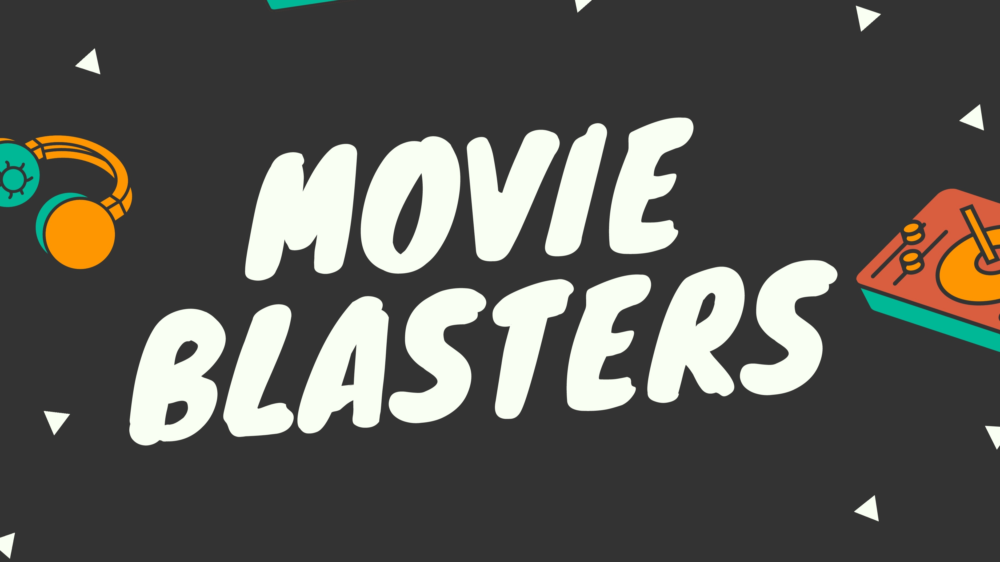

# 🎬 Movie Blasters - A Daily Movie Guessing Game

Welcome to **Movie Blasters**, a fun, lightweight, and challenging daily game for movie buffs of all languages and generations. Think *Wordle*, but with movies and 5 juicy clues. Each day brings a new movie, and your mission—should you choose to accept it—is to guess the correct title before the clues run out!

---

## ✨ What's inside?

- 🔍 **Guess a movie a day** — Get 5 unique clues, one at a time.
- 🕵️ **Language selection** — Play in your preferred language.
- 📜 **Instructions upfront** — First-time users get a clear walkthrough.
- ⏱️ **Timer & Score** — Beat the clock, but beware: wrong guesses add 5 seconds!
- 📦 **No login, no fuss** — Just open and play.
- 🌐 **Hosted on Netlify** — Quick, secure, and blazing fast.

---

## 📦 How It Works

1. On landing, choose your preferred **language**.
2. Read the **game instructions** so you're not lost.
3. Each game has:
   - A hidden movie (randomly selected for that language).
   - 5 clues — shown one-by-one as you guess.
4. Guess the movie using the input box.
5. If you're right, you win!
6. If you're wrong, you'll get a new clue… but it costs you **+5 seconds**.
7. After 5 clues, if you still haven’t guessed it — Game Over!

---

## 🛠️ Project Structure

```
📁 public/
   └── index.html
📁 src/
   ├── App.vue
   ├── components/
   │   └── Game.vue
   ├── assets/
   │   └── logo.png
   ├── data/
   │   ├── movies-en.json
   │   ├── movies-hi.json
   │   └── language-id-map.json
📁 netlify/functions/
   └── getMovie.js
```

---

You can contribute your own language films to the dataset too! Just add a `movies-xx.json` file and update the `language-id-map.json`.

---

## 🧠 Clue Format (Example)

```json
{
  "id": "inception",
  "language": "English",
  "clues": [
    "A dream within a dream.",
    "Directed by Christopher Nolan.",
    "Stars Leonardo DiCaprio.",
    "Mind-bending plot about subconscious.",
    "Released in 2010."
  ]
}
```

---

## 🚀 Running Locally

1. Clone the repo  
   ```bash
   git clone https://github.com/yourusername/movie-blasters.git
   cd movie-blasters
   ```

2. Install dependencies  
   ```bash
   npm install
   ```

3. Start the dev server  
   ```bash
   npm run dev
   ```

4. (Optional) Setup Netlify Functions for production use.

---

## 🌍 Deploying to Netlify

Make sure your `netlify.toml` file is configured for functions. Then just:

```bash
netlify deploy --prod
```

---

## 🙌 Contributors

Made with ❤️ by [Paav](https://github.com/Paavendan-JM) and supported by a community of passionate developers.

Feel free to open an issue or PR for bugs, suggestions, or new movie packs!

---

### 🥳 Enjoy playing Movie Blasters!
May the clues be ever in your favor 🎥
